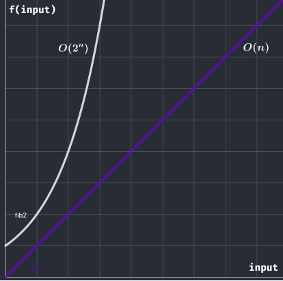

# 16 - Introdução à Complexidade (Big O Notation)

Analisar a complexidade de um algoritmo é uma tarefa importante para entender as limitações associadas ao código. Podemos encontrar mais desse tema através dos nomes *análise assintótica* ou *Big O Notation*.

Não conseguimos fazer uma analise precisa do tempo, pois depende de fatores particulares da entrada. Entretanto, conseguimos medir a complexidade **em função dos parâmetros da entrada.**

## Primeiro passo: **Contando operações**

Vamos estudar particularmente a [**sequência de fibonacci**](https://pt.wikipedia.org/wiki/Sequ%C3%AAncia_de_Fibonacci#:~:text=Os%20n%C3%BAmeros%20de%20Fibonacci%20s%C3%A3o,%2C%202584%2C%20...%20.). Simplificando o problema: temos uma sequência que inicialmente {0, 1} e todo próximo número dessa sequência é definido como soma dos dois antecessores.

Ex.: {0 , 1 , 1 , 2 , 3 , 5 , 8, ... }

1ª implementação - ***botton up***: definimos os casos base e iremos escalando até chegarmos no resultado desejado.

```cpp{0}
// @he4rt developers - Hugo Rafael

#include <iostream>

int main()
{

  int n; // inteiro n
  std::cin >> n; // dou entrada em n

  // crio a sequencia e seus casos base
  int fibonacci[n+1];
  fibonacci[0] = 0; // caso base para zero
  fibonacci[1] = 1; // caso base para um

  for(int i=2; i<=n; i++)
  { // faço os calculos a partir do segundo
    fibonacci[i] = fibonacci[i-1] + fibonacci[i-2]; // escalo com as repostas
  }

  std::cout << fibonacci[n] << std::endl; // reposta

}
```

2ª implementação - ***top down:*** Utilizando funções recursivas até chegar nos casos base.

```cpp{0}
// @he4rt developers - Hugo Rafael

#include <iostream>

int fibonacci(int n)
{

  if(n==0) return 0; // caso base para o zero
  if(n==1) return 1; // caso base para o um

  return fibonacci(n-1) + fibonacci(n-2); // algoritmo recursivo
}

int main()
{

  int n; // inteiro n
  std::cin >> n; // dou entrada em n

  std::cout << fib(n) << std::endl; // resposta

}
```

Para a 1ª implementação, temos 2 operações feitas para atribuir os casos base do array e depois temos um for que faz n-1 operações, indo de 2 até n(inclusive). 

Para a 2ª implementação, temos a chamada de 2 operações para cada operação que não é um caso base. Deste modo, o número de operações sempre se multiplica por 2, tendo como número total de operações feitas 2^n.

> Conseguiu notar que o número de operações é uma função de n?

Se sim, agora você deu o primeiro passo para entender a **Big O Notation**.

## Segundo passo: Análise assintótica / Big O Notation


A Big O Notation é um conjunto a qual funções matemáticas podem pertencer, exatamente como uma família de funções que definidas por uma restrição.

Seja a função fib1(n) = n, a função que conta o total de operações realizadas pela primeira implementação. Esta função é uma função **linear**,
por isto dizemos que a complexidade deste algoritmo é **linear**.

Em termos de notação:

> fib1(n) = n 

> fib1(n) pertence a **O(n)**

A expressão O(n) indica que a função do número de operações é dada por uma [função linear](https://pt.wikipedia.org/wiki/Fun%C3%A7%C3%A3o_afim).

Uma particularidade da *Big O* é a capacidade de interpretar quem *realmente* faz diferença nos piores casos do programa. Se o código do programa 1 fosse atualizado para:

```cpp{9-13}
#include <iostream>

int main()
{

  int n; // inteiro n
  std::cin >> n; // dou entrada em n

  if(n < 0 )
  {
    std::cout << "Entrada inválida!" << std::endl;
    return 0;
  }

  // crio a sequencia e seus casos base
  int fibonacci[n+1];
  fibonacci[0] = 0; // caso base para zero
  fibonacci[1] = 1; // caso base para um

  for(int i=2; i<=n; i++)
  { // faço os calculos a partir do segundo
    fibonacci[i] = fibonacci[i-1] + fibonacci[i-2]; // escalo com as repostas
  }

  std::cout << fibonacci[n] << std::endl; // reposta

}
```

O trecho em destaque adicionado pertence a O(1), isto é o que chamamos de tempo constante para a *Big O*, as atribuições, os `cout`'s e `if`'s mais simples pertencem a ordem constante de complexidade.

Entretanto, nossa fib1(n) passa a ter n+1 operações.

> Dado tudo que já foi estudado, sua compexidade linear O(n) mudaria?

A resposta é **NÃO**! A *Big O Notation*, como comentei, indica um **conjunto** a qual uma *família de funções* pertence.

> fib1(n) = n+1

> fib1(n) pertence a O(n)

Em termos práticos, quem efetivamente é capaz de piorar a execução do nosso programa, é a entrada `n`.

Seja a função fib2(n) = 2^n, a função que conta o número de operações realizadas pela segunda implementação. Esta é uma função **exponencial**, por isto dizemos que a complexidade deste algoritmo é **exponencial.**

> fib2(n) = 2^n

> fib2(n) pertence a O(2^n)

## Aplicando os resultados obtidos

| Gráfico `n` **x** ` fib(n)` | 
| :-----------: |
|    | 
| *E agora, ficou mais fácil perceber qual algoritmo performa melhor?* |

Através deste exemplo percebemos que **o algoritmo da 1ª implementação performa melhor**, pois o número de operações feitas cresce mais devagar. 

Além disso, é mais fácil fazer esta análise quando estamos olhando para a *Big O*, pois é matemáticamente mais simples de comparar qual função é *superior a longo prazo*, isto é, **nos piores casos da entrada**.Para entradas pequenas a diferença pode ser pouca, mas as vezes fazemos operações da ordem de 10^5:

> fib1(10^5) = 10^5 = 100,000 

> fib2(10^5) = 2^(10^5) = possui 30,103 dígitos !!!

No próximo módulo veremos mais sobre o funcionamento da *Big O* e exemplos de outras complexidades de algoritmos.