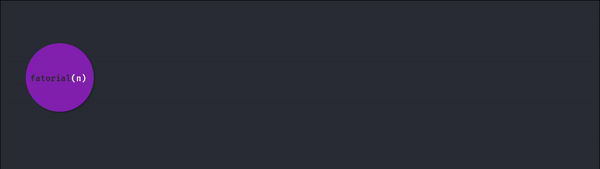

# 8.3 - Recursão

Recursão é um conceito não exclusivo do C++, onde uma função chama a si mesma até que uma condição seja alcançada.

Tudo que pode ser resolvido por loops, pode ser resolvido por recursão.
Tudo que pode ser resolvido por recursão, pode ser resolvido por loops.

> Por que usar recursão?

**Legibilidade.** Algumas coisas parecem ter *nascido* para uma interpretação recursiva!

## Conceitos iniciais

- **Caso base:** Todas chamadas realizadas nas funções recursivas precisam parar em algum momento, senão teríamos um programa rodando infinitamente. Por isso, criamos casos base.

- **Função recursiva:**

> Muitos problemas tem como seus casos base como casos pequenos e simples de serem feitos a mão, e deixamos a resposabilidade de casos maiores para a função recursiva recursão precisa parar em algum momento para que o problema funcione.

## Situação problema 1: [Fatorial](https://pt.wikipedia.org/wiki/Fatorial)

Faça um programa capaz de retornar (recursivamente), dado um inteiro `number`, o valor da operação fatorial de `number`.

## Interpretando e resolvendo

A operação



## Código da situação problema

```cpp{0}
// he4rt developers - Hugo Rafael

#include <iostream>

int factorial(int number)
{
  // verificamos se é um caso base
  // se for, retornamos a respostanda conhecida
  if (number == 0) return 1;

  // caso não seja conhecido,
  // deixamos a responsabilidade para a função recursiva
  return number * factorial(number - 1);
}

int main ()
{

    int n; // declarando input
    std::cin >> n; // entrando com o input

    // retornando o fatorial
    std::cout << factorial(n) << std::endl;  
}
```

| `input` | `output` | status |
| :-----: | :------: | :------: |
| `1` | `1` | ok! |
| `3` | `6` | ok! |
| `5` | `120` | ok! |

**nota:** quando temos apenas um comando no `if`, a sintaxe utilizada na função `fatorial` também é aceita no C++.

## Situação problema 2: [Fibonacci](https://pt.wikipedia.org/wiki/Sequ%C3%AAncia_de_Fibonacci)
